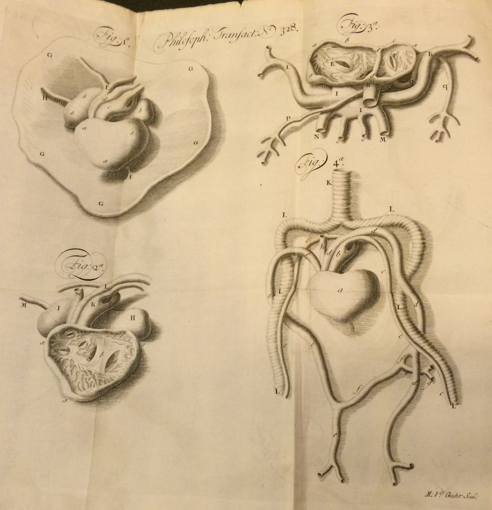

% John Arbuthnot's Sexy Big Data
% Reexamining *An Argument for Divine Providence*
% James P. Ascher, University of Virginia

# 

*Philosophical Transactions* Vol. 27  Num. 328

4^o^: π^2^ Z--2D^4^ [\$1--2 signed]; 22 leaves, pp. 169--211 [212];
plate [*1*]\
000004 - b1 Z1 i : b2 2D2 rs\$its\$ [NYPL]

Plate of figures 1--4 [**169 (π1^r^)**: NYPL]

# 

#
M + F

#
(M + F)^2^ = (M + F)(M + F) = M^2^ + 2MF + F^2^

#
(M + F)^n^ =\
M^n^ + n M^n-1^F ... +  C M^n/2^ F^n/2^ + ... n MF^n-1^ + F^n^

Where C binomial coefficient n choose n/2.

#

#

John Arbuthnot (1710)
:  1 / 2^82^ ≅ 10^-26^

#

John Arbuthnot (1710)
:  1 / 2^82^ ≅ 10^-26^

Willem 'sGravesande (1712)
:  0.2917^82^ ≅ 10^-45^

#

John Arbuthnot (1710)
:  1 / 2^82^ ≅ 10^-26^

Willem 'sGravesande (1712)
:  0.2917^82^ ≅ 10^-45^

Niklaus Bernoulli (1713)
:  0.978 i.e. 0.9999 for the few errors 

#

| Mad *Mathesis* alone was unconfin'd,
| Too mad for mere material chains to bind,
| Now to pure Spaces lifts her extatic stare,
| Now running round the Circle, finds it square.

(*Dunciad in Four Books* IV.31--34)

#

The number of the inhabitants of London determined by the reports of
the gold-finders, and the tonnage of their carriages; with allowance
for the extraordinary quantity of the *ingesta* and *egesta* of the
people of England, and a deduction of what is left under dead walls,
and dry ditches. (*Memoirs of Scriblerus* Ch. 14)

# 

